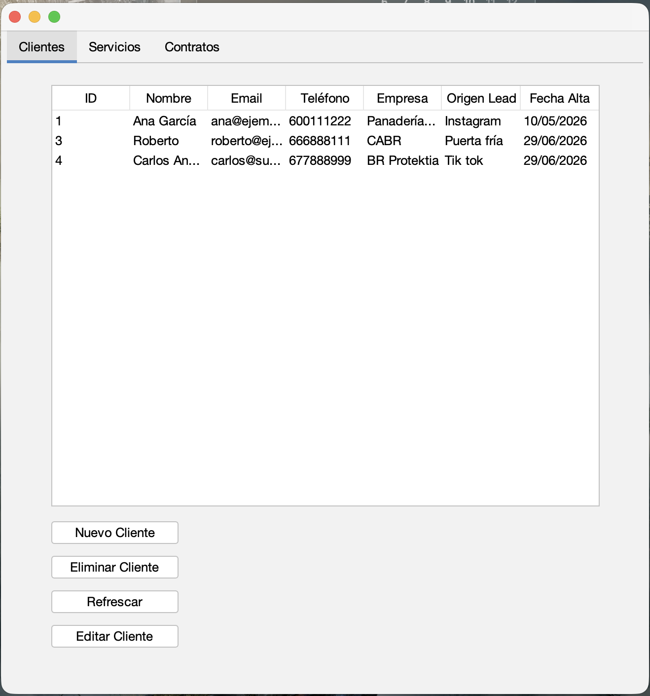
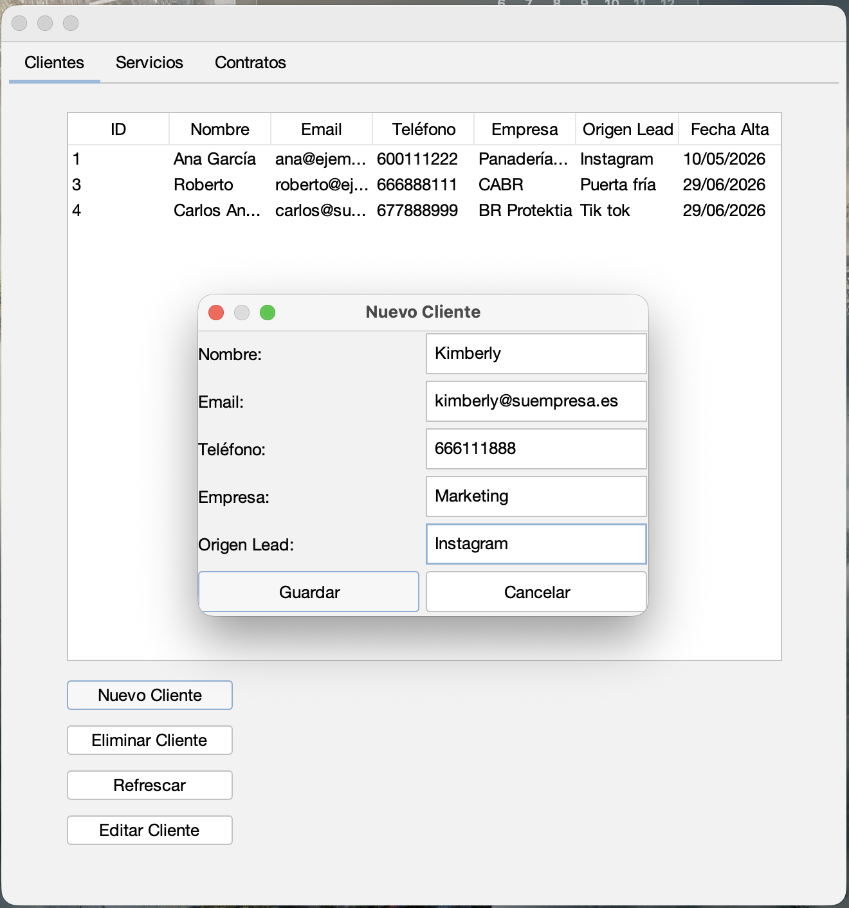
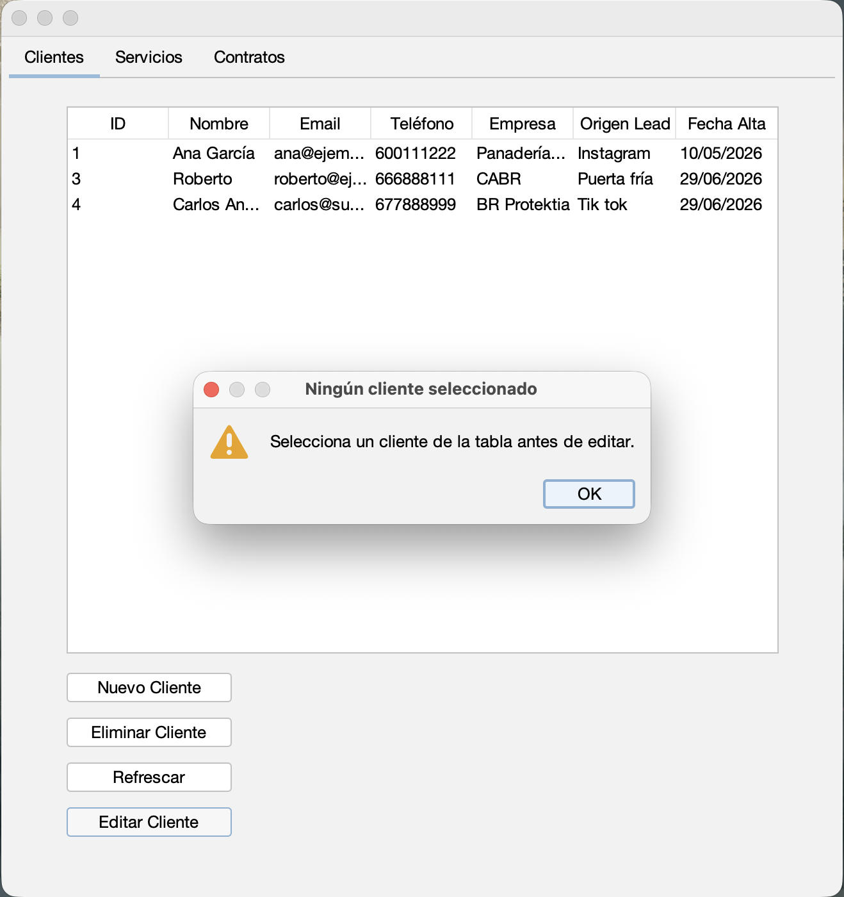
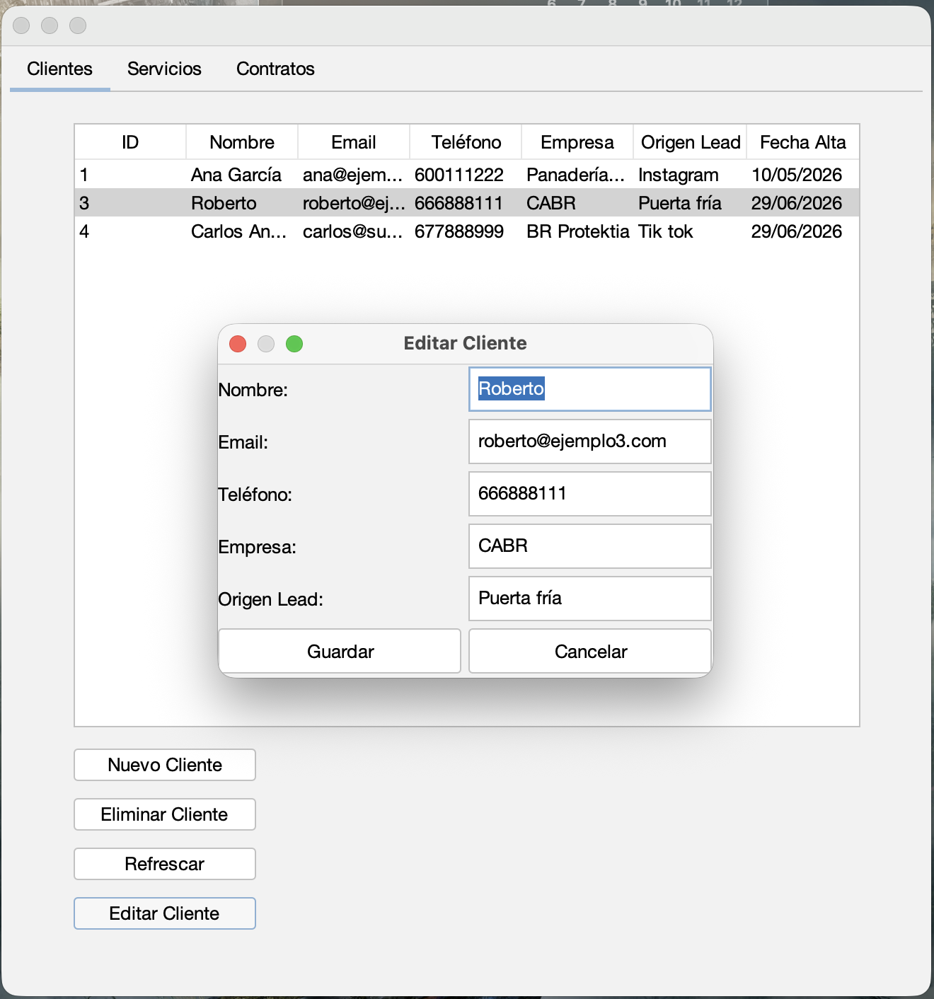
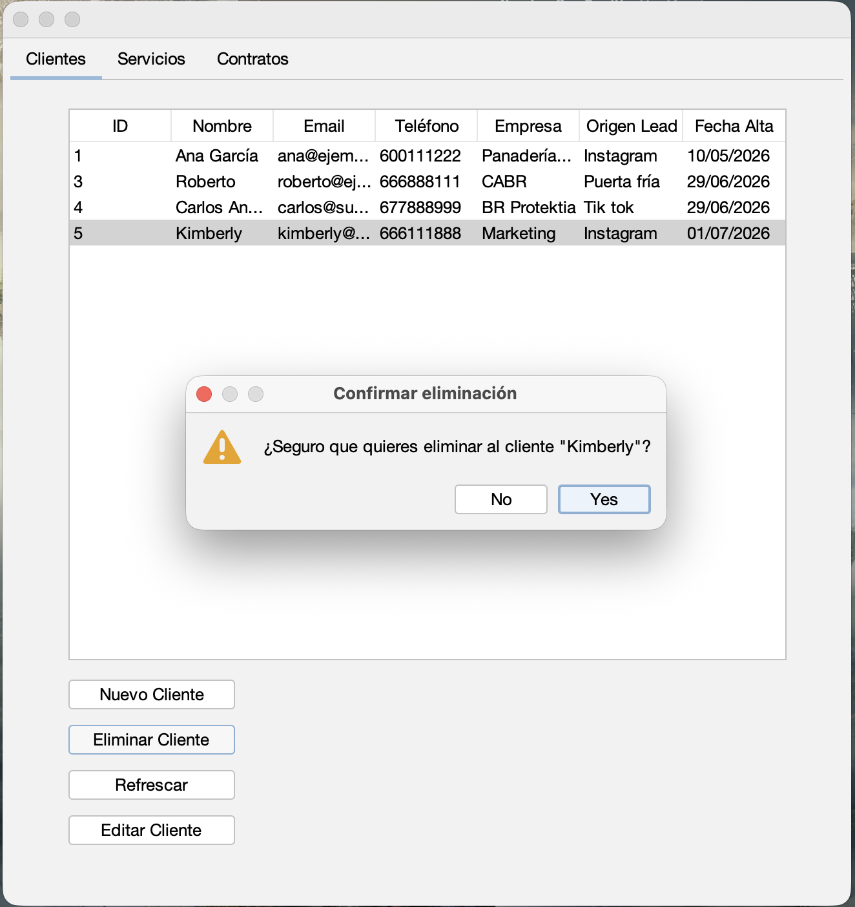
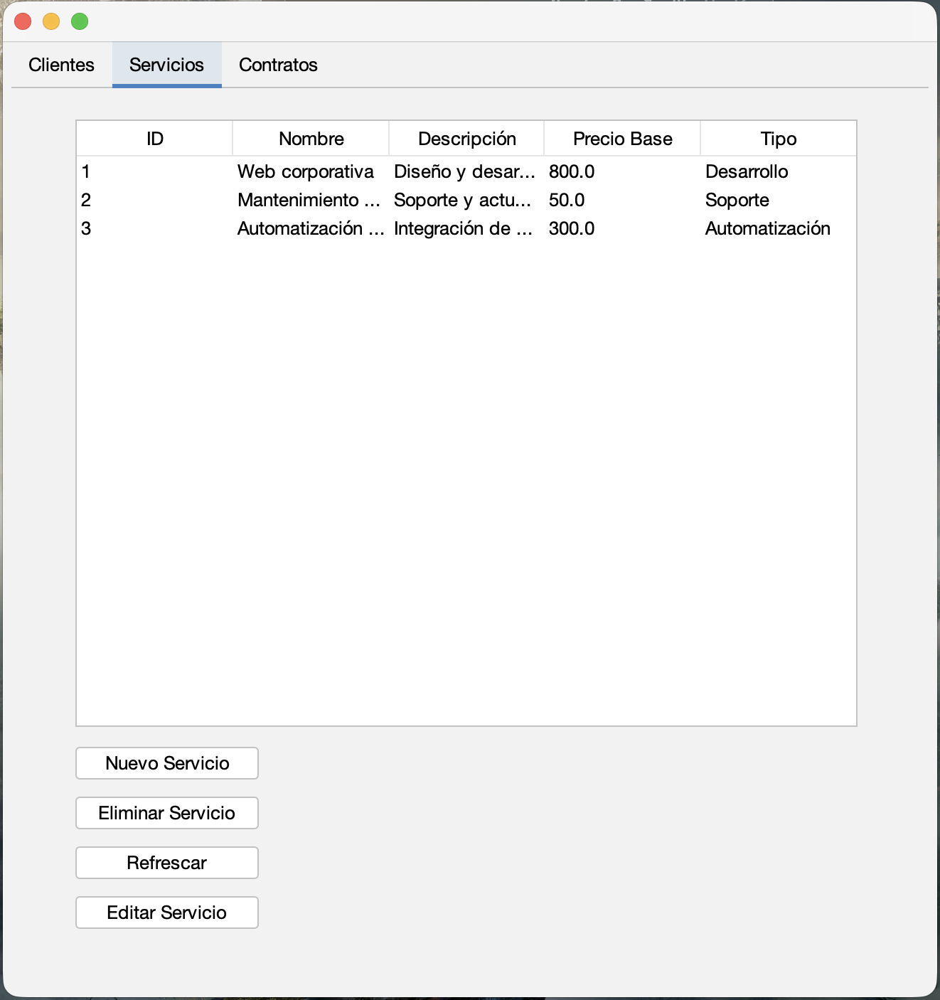
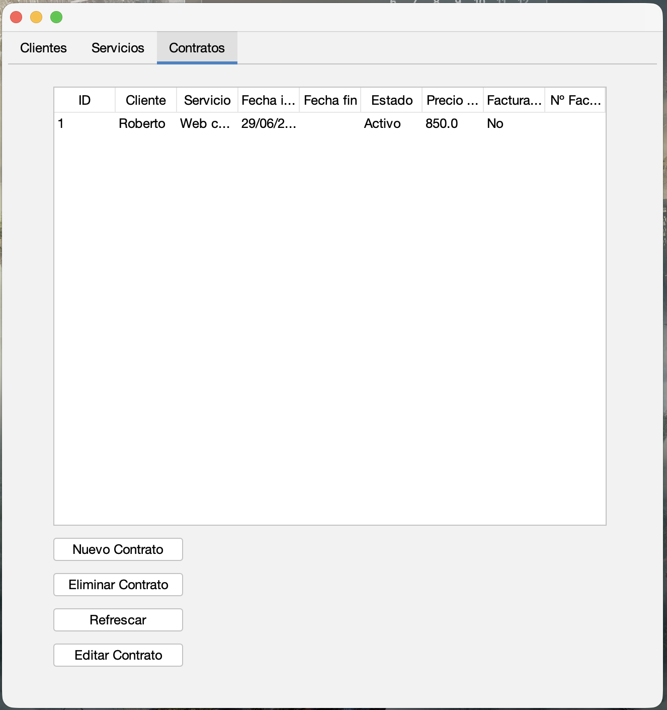

# ArusCRM

Aplicación de escritorio para la gestión de clientes, servicios y contratos de **ARUS SYSTEM**, desarrollada como proyecto de portfolio dentro del ciclo formativo de Desarrollo de Aplicaciones Multiplataforma (DAM).

## Descripción

ArusCRM es un CRM sencillo orientado a la gestión comercial de una pequeña empresa de servicios tecnológicos. Permite dar de alta, consultar, editar y eliminar clientes, servicios y los contratos que los relacionan, con una interfaz de escritorio construida en Java Swing.

## Funcionalidades

- **Gestión de Clientes**: alta, edición, baja y listado.
- **Gestión de Servicios**: alta, edición, baja y listado.
- **Gestión de Contratos**: asociación de un cliente con un servicio, fecha de contratación y estado de facturación.
- CRUD completo (Crear, Leer, Actualizar, Eliminar) sobre las tres entidades, con persistencia en base de datos MySQL.

## Tecnologías utilizadas

- **Java** (POO: herencia, sobrescritura de métodos, colecciones)
- **Swing** + **FlatLaf** para la interfaz gráfica
- **JDBC** para la conexión con la base de datos
- **MySQL** como sistema gestor de base de datos
- **NetBeans** como entorno de desarrollo

## Estructura del proyecto

```
src/
├── aruscrm/        # Clase principal, ventana principal y formularios (GUI)
│   ├── ArusCRM.java
│   ├── VentanaPrincipal.java
│   ├── FormularioCliente.java
│   ├── FormularioServicio.java
│   ├── FormularioContrato.java
│   └── ComboItem.java
├── dao/            # Acceso a datos (CRUD vía JDBC)
│   ├── ConexionBD.java
│   ├── ClienteDAO.java
│   ├── ServicioDAO.java
│   └── ContratoDAO.java
└── modelo/         # Modelo de datos
    ├── Persona.java
    ├── Cliente.java
    ├── Servicio.java
    └── Contrato.java
```

## Arquitectura

El proyecto sigue una separación por capas:

- **Modelo**: clases que representan las entidades del dominio. `Cliente` extiende de la clase abstracta `Persona`.
- **DAO**: una clase de acceso a datos por entidad, con operaciones CRUD mediante `PreparedStatement` y `try-with-resources`.
- **GUI**: una ventana principal (`JFrame`) con pestañas (`JTabbedPane`) para cada entidad, cada una con su tabla y botones de acción. Los formularios de alta/edición son ventanas modales (`JDialog`) que funcionan tanto para crear un registro nuevo como para editar uno existente.

## Configuración de la base de datos

La conexión se gestiona en `dao/ConexionBD.java` y admite configuración mediante variables de entorno, con valores por defecto para desarrollo local:

| Variable | Descripción | Valor por defecto |
|---|---|---|
| `ARUS_DB_URL` | URL JDBC de conexión | `jdbc:mysql://localhost:10004/arus_crm?useSSL=false&allowPublicKeyRetrieval=true&serverTimezone=UTC` |
| `ARUS_DB_USER` | Usuario de la base de datos | `root` |
| `ARUS_DB_PASSWORD` | Contraseña de la base de datos | `root` |

Para usar tu propia configuración, define estas variables de entorno antes de ejecutar la aplicación, o modifica directamente los valores por defecto en `ConexionBD.java`.

La base de datos necesita una base llamada `arus_crm` con las tablas correspondientes a clientes, servicios y contratos (la tabla de contratos relacionada mediante claves foráneas con clientes y servicios).

## Requisitos

- JDK 21
- MySQL (probado con LocalWP)
- Conector JDBC de MySQL (`mysql-connector-j`)
- FlatLaf

## Estado del proyecto

Proyecto funcional con CRUD completo implementado para las tres entidades. Pensado como base extensible hacia funcionalidades futuras como facturación o integración de leads desde web.

## Capturas de pantalla

### Listado de clientes


### Formulario de clientes


### Aviso de selección


### Editar cliente


### Eliminar cliente


### Listado de servicios


### Listado de contratos


---

Proyecto desarrollado por Roberto Solana como parte de su portfolio de prácticas DAM.
